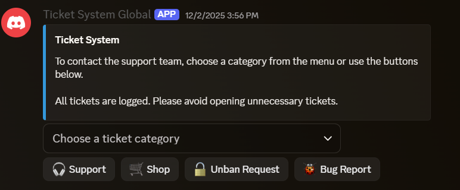
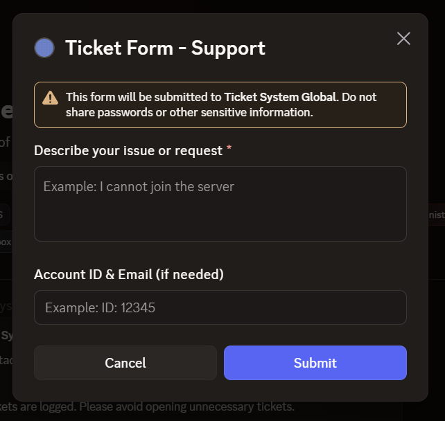
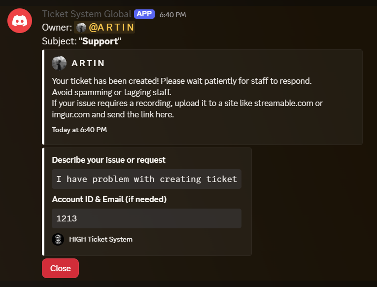
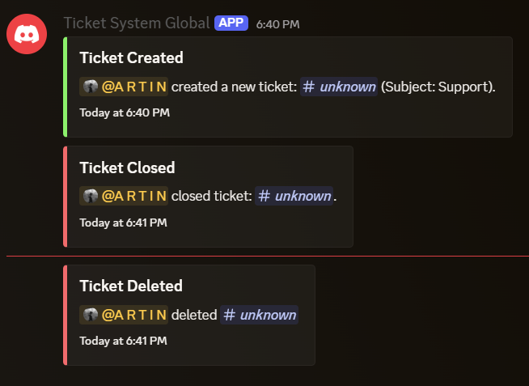

# Ticket-System-Global

## 🎫 Discord Ticket System Bot

A complete and customizable Discord Ticket System built with Node.js and Discord.js.
This bot allows users to open support tickets through buttons or commands and gives staff full control over managing them.

## ⭐ Features

- Create support tickets

- Close / delete tickets

- Ticket panels with buttons

- Organized folder structure

- Fully customizable messages

- Easy setup and configuration

- Stable, clean, and production-ready

## ⚙️ 1. Creating Your Discord Bot (Token, Client ID, Intents)

To use this project, create a bot in the Discord Developer Portal.

🔹 Step 1 — Create a Bot

Go to Applications

Click New Application

Enter a name → Create

🔹 Step 2 — Add Bot User

Navigate to:
Bot → Add Bot → Confirm

🔹 Step 3 — Grab Your Token

Go to:
Bot → Token → Reset Token

⚠️ NEVER upload your token to GitHub.
(Use .gitignore, environment variables, or a config template.)

🔹 Step 4 — Get Your Client ID

Go to:
OAuth2 → General → Application ID

## 🔧 2. Enable Required Gateway Intents

Inside: Bot → Privileged Gateway Intents

✅ Presence Intent

Required for receiving Presence Update events.

NOTE: When your bot reaches 100+ servers, Discord requires verification.

✅ Server Members Intent

Required for receiving member-related events under GUILD_MEMBERS.

NOTE: Requires verification after 100+ servers.

✅ Message Content Intent

Required for receiving message content in most messages.

NOTE: Requires verification after 100+ servers.

Make sure all three are ON.

## 📥 3. Downloading This Ticket System

You can download the bot files in two ways:

🔹 Option 1 — Git Clone (Recommended)
git clone https://github.com/YOUR_USERNAME/YOUR_REPO_NAME.git

🔹 Option 2 — Download ZIP

Click the Code button

Select Download ZIP

Extract the ZIP file

## 📦 4. Installing Dependencies

After entering the project folder, run:

npm i

This installs all required packages (like discord.js).

## 📞 5. Support / Contact

If you have issues, questions, or want to contact me directly:

Discord: artinlp#4063

## 🖼️ 6. Images / Screenshots

